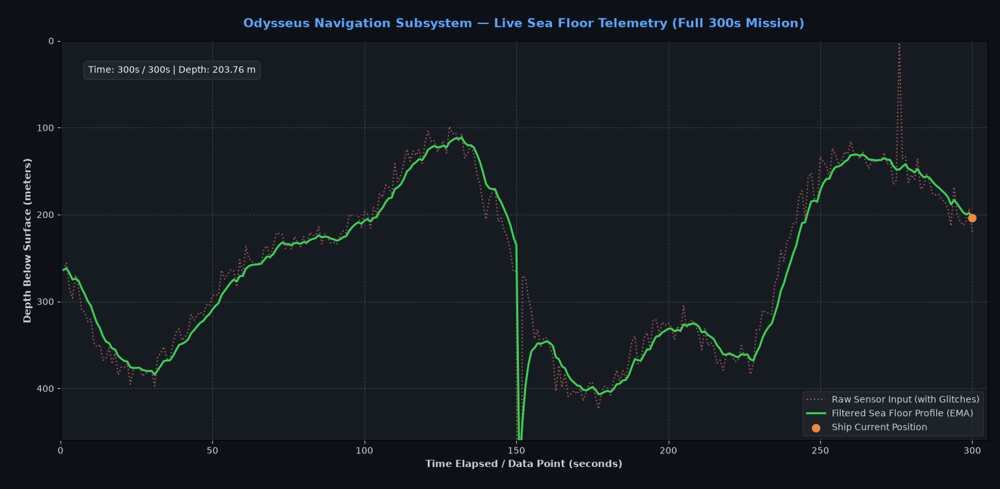
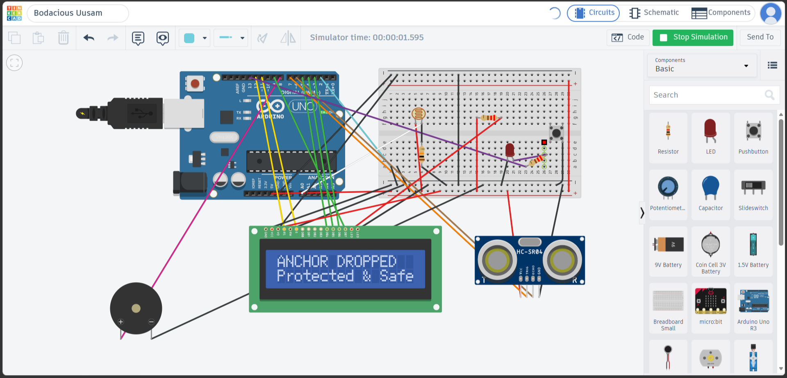

# SEDS BPHC — Avionics Induction 2026-27
**Name:** Yashvardhan Singh  
**ID:** 2025A7PS0112H  
**Track:** Avionics Subsystem  

## 📌 Overview
This repository contains my complete submission for the SEDS Avionics Round 1 induction. It includes a Python-based data sanitization pipeline for sonar telemetry, and an Arduino-based Finite State Machine (FSM) for embedded hazard monitoring.

### 🛠️ Technologies & Libraries Used
* **Task 1 (Software):** Python 3, Pandas (Data Manipulation), NumPy (Math Operations), Matplotlib (Live Animation).
* **Task 2 (Hardware):** C++, Arduino IDE, Tinkercad Circuits, LiquidCrystal Library.

---

## 🌊 Task 1: Finding the Sea Floor (Data Processing)

**Objective:** 
Clean a noisy, corrupted bathymetric dataset and build a live telemetry animation of the seabed.

**Step-by-Step Approach:**
1. **Data Ingestion & Sanitization:** 
   I used `pandas` to read the CSV. The raw data had string errors like `#VALUE!` and sensor dropouts (zero/negative depths). I coerced the text errors into blank NaN values and masked out any impossible negative depths.
2. **Outlier Filtration (Removing Spikes):** 
   Sonar data often has false reflections. I implemented a rolling median window (7 data points) to find the local average. Any data point that spiked too far away from its neighbors (using a standard deviation check) was flagged as an error and removed.
3. **Reconstruction & Smoothing:** 
   To fill in the gaps, I used linear interpolation to draw continuous lines between valid points. I then applied an Exponential Moving Average (EMA) to smooth out the jagged high-frequency noise, resulting in a realistic sea floor curve.
4. **Live Animation:** 
   I used `matplotlib.animation` to render a live Heads-Up Display (HUD). I designed a dark nautical theme, plotting the raw data lightly in the background and the smoothed data in the foreground. An orange marker dynamically tracks the ship's position over the 300-second timeline.

**How to Run:**
Open your terminal/command prompt, navigate to the project directory, and execute:  
`python task1_sea_floor.py`

**Graph Screenshot:**

---

## ⚓ Task 2: Keeping Watch Over Odysseus (Embedded FSM)

**Objective:** 
Design a non-blocking embedded warning system using an Arduino to detect environmental hazards.

**Step-by-Step Approach:**
1. **Finite State Machine (FSM) Architecture:** 
   I structured the core logic with five distinct states: `OPEN_SEA`, `STORM`, `CHARYBDIS` (obstacle), `ANCHOR_DROPPED`, and `WRECKED`. The entire loop runs using `millis()` instead of `delay()`, ensuring the Arduino never freezes and can always read sensors instantly.
2. **Sensor Integration:** 
   * **Ambient Light (LDR):** Continuously reads analog voltage. If brightness drops below 50%, it triggers the `STORM` state.
   * **Proximity (HC-SR04):** Pings ultrasonic waves to measure distance. If an object is detected under 100 cm, it triggers `CHARYBDIS`.
3. **Countdown Logic:** 
   When a hazard is detected, a 5-second timer begins. If the hazard clears before the time is up, the system safely returns to `OPEN_SEA`. If the timer hits 5 seconds, the system permanently locks into the `WRECKED` state.
4. **Hardware Interrupt & Debouncing:** 
   I added a manual pushbutton to drop the anchor (`ANCHOR_DROPPED`), overriding all alarms. Because physical buttons "bounce" and send multiple signals when pressed once, I wrote a software debounce logic (a 50ms delay window) to ensure clean button presses.
5. **Telemetry UI:** 
   A 16x2 LCD constantly refreshes to display the current operational state, distance, and time remaining until a wreck. A flashing LED and a piezo buzzer provide visual and acoustic hazard warnings.

**Tinkercad Circuit Screenshot:**

---
*Note: Both code files have been thoroughly documented with professional in-line comments to explain the underlying logic.*